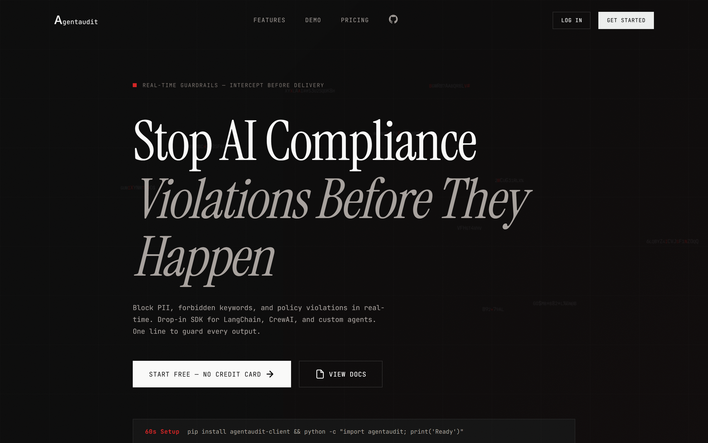
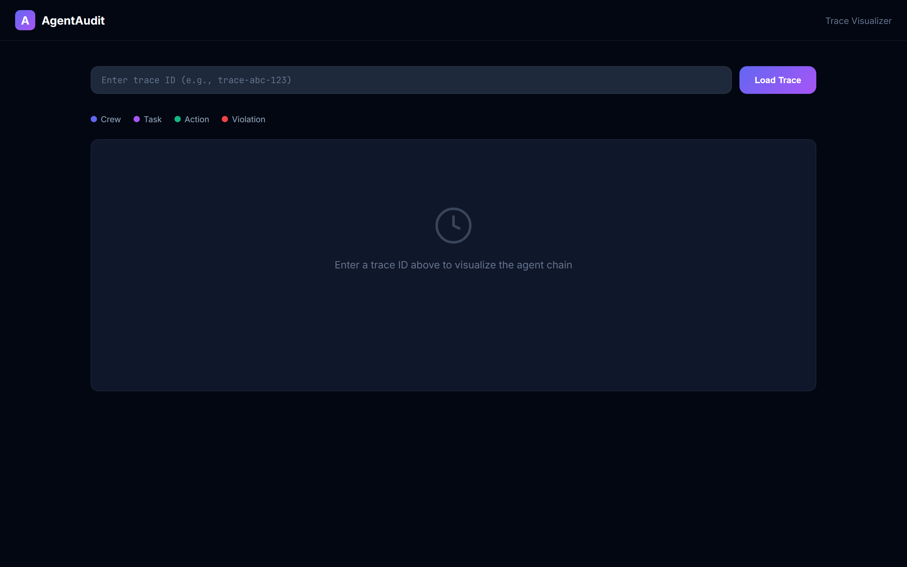

<div align="center">

# AgentAudit API

**Real-time guardrails for AI agents. Block PII, policy violations, and risky outputs before they reach users.**

[](https://agentaudit-api-production.up.railway.app/health)
[](LICENSE)
[](https://railway.app/template/agentaudit)
[](https://agentaudit-api-production.up.railway.app/health)

[](https://pypi.org/project/agentaudit-client/)
[](https://www.npmjs.com/package/agentaudit-client)

</div>

---

## Why AgentAudit?

Most AI compliance tools **log violations after they happen**. AgentAudit **blocks them in real-time** — before your agent's output ever reaches a user.

| What Others Do | What AgentAudit Does |
|----------------|----------------------|
| Log PII after it's sent | Block PII **before** delivery |
| Alert on policy violations | **Prevent** policy violations |
| Post-hoc audit reports | Real-time guardrail with audit trails |
| Manual compliance review | One-line SDK, zero config |

---

## Live Demo

**API Base URL:** `https://agentaudit-api-production.up.railway.app`

**Landing Page:** [agentaudit-api-production.up.railway.app](https://agentaudit-api-production.up.railway.app/)

**Trace Visualizer:** [agentaudit-api-production.up.railway.app/trace-visualizer.html](https://agentaudit-api-production.up.railway.app/trace-visualizer.html)

Try the interactive demo — paste some text with a fake SSN and watch it get flagged instantly.

---

## Screenshots

<div align="center">

### Landing Page


### Trace Visualizer


</div>

> **Tip:** Try the live demo at [agentaudit-api-production.up.railway.app](https://agentaudit-api-production.up.railway.app/)

- [Features](#-features)
- [Architecture](#%EF%B8%8F-architecture)
- [Quick Start](#-quick-start)
- [SDKs](#-sdks)
- [CrewAI Integration](#-crewai-integration)
- [Compliance Rules](#-compliance-rules)
- [API Reference](#-api-reference)
- [Self-Hosting](#-self-hosting)
- [Contributing](#-contributing)
- [License](#-license)

---

## Features

### Core
- **Real-Time Guardrails** — Block violations before delivery, not after
- **Agent-to-Agent Audit Trails** — Distributed tracing with `traceId` + `parentSpanId`
- **6 Compliance Rule Types** — PII, keywords, rate limits, regex, sentiment, custom validators
- **Webhook Alerts** — Async delivery to your endpoint on every violation
- **Compliance Reports** — Export JSON/CSV for any date range

### Integrations
- **CrewAI** — Drop-in `AgentAuditObserver` with `guard=True/False` + distributed tracing
- **LangChain** — Callback handler with real-time guardrails + `traceId`/`parentSpanId` propagation
- **AutoGPT** — Decorator and context manager with guardrails + trace linking
- **OpenAI** — Wrapped client with automatic guarding and audit logging on every call

### DevEx
- **Python SDK** — `pip install agentaudit-client`
- **TypeScript SDK** — `npm install agentaudit-client`
- **Self-Hostable** — Docker, Railway, bare-metal
- **API Key + JWT** — Service-to-service + dashboard auth

---

## Architecture

```
┌─────────────┐     ┌──────────────┐     ┌─────────────┐
│   CrewAI    │────▶│  Guardrail   │────▶│  Audit Log  │
│   Agent     │     │  (Real-time) │     │  + Trace    │
└─────────────┘     └──────────────┘     └─────────────┘
                            │
                            ▼
                    ┌──────────────┐
                    │  Compliance  │
                    │    Rules     │
                    │  (PII/Key/   │
                    │  Regex/etc)  │
                    └──────────────┘
                            │
                            ▼
                    ┌──────────────┐
                    │   Alerts +   │
                    │   Webhooks   │
                    └──────────────┘
```

### Tech Stack
- **Runtime:** Node.js 20+ with TypeScript
- **Framework:** Express.js
- **Database:** PostgreSQL (Prisma ORM)
- **Validation:** Zod
- **Testing:** Jest + Supertest
- **Logging:** Pino

---

## Quick Start

### Prerequisites
- Node.js 20+
- PostgreSQL 15+

### 1. Clone & Install

```bash
git clone https://github.com/AspicyKabob/-agentaudit-api.git
cd -agentaudit-api
npm install
```

### 2. Configure Environment

```bash
cp .env.example .env
# Edit .env with your database credentials
```

### 3. Database Setup

```bash
npx prisma migrate dev --name init
npx prisma generate
```

### 4. Start Development

```bash
npm run dev
# API available at http://localhost:8080
```

### Deploy to Railway (One-Click)

[](https://railway.app/template/agentaudit)

---

## SDKs

### Python

```bash
pip install agentaudit-client
```

```python
from agentaudit import AgentAudit

audit = AgentAudit(api_key="aa_your_key_here")

# Real-time guardrail
result = audit.guardrail(
    action="prompt_submitted",
    prompt="User: My SSN is 123-45-6789",
    response="Here is your account info..."
)

if not result.allowed:
    raise ValueError(f"Blocked: {result.violations}")

# Log with trace support
audit.log(
    action="crewai_task_end",
    trace_id="trace-abc-123",
    parent_span_id="log-parent-456",
    response="Task completed successfully"
)

# Batch logging — submit up to 100 entries in one request
logs = audit.log_batch([
    {"action": "llm_start", "prompt": "Hello", "metadata": {"model": "gpt-4"}},
    {"action": "llm_end", "response": "Hi there", "metadata": {"tokens": 12}}
])
print(f"Batch: {len(logs)} processed")
```

### TypeScript

```bash
npm install agentaudit-client
```

```typescript
import { AgentAudit } from 'agentaudit-client';

const audit = new AgentAudit({ apiKey: 'aa_your_key_here' });

const result = await audit.guardrail({
  action: 'prompt_submitted',
  prompt: 'User: My SSN is 123-45-6789',
  response: 'Here is your account info...'
});

if (!result.allowed) {
  throw new Error(`Blocked: ${result.violations.join(', ')}`);
}

await audit.log({
  action: 'crewai_task_end',
  traceId: 'trace-abc-123',
  parentSpanId: 'log-parent-456',
  response: 'Task completed successfully'
});

// Batch logging — submit up to 100 entries in one request
const { data, processed, errors } = await audit.logBatch([
  { action: 'llm_start', prompt: 'Hello', metadata: { model: 'gpt-4' } },
  { action: 'llm_end', response: 'Hi there', metadata: { tokens: 12 } }
]);
console.log(`Batch: ${processed} processed, ${errors} errors`);
```

### Batch Logging

Both SDKs support submitting up to 100 audit log entries in a single request via `logBatch()`. This is ideal for high-throughput agents that generate many events per second.

| SDK | Method | Max Entries | Returns |
|-----|--------|-------------|---------|
| Python | `audit.log_batch([...])` | 100 | `List[AuditLog]` |
| TypeScript | `audit.logBatch([...])` | 100 | `{ data, processed, errors }` |

```bash
curl -X POST https://agentaudit-api-production.up.railway.app/api/v1/audit-logs/batch \
  -H "X-API-Key: aa_your_api_key_here" \
  -H "Content-Type: application/json" \
  -d '[
    { "action": "llm_start", "prompt": "Hello", "metadata": { "model": "gpt-4" } },
    { "action": "llm_end", "response": "Hi there", "metadata": { "tokens": 12 } }
  ]'
```

---

## CrewAI Integration

```python
from crewai import Crew, Agent, Task
from agentaudit_crewai import AgentAuditObserver

observer = AgentAuditObserver(
    api_key="aa_your_key_here",
    crew_name="Research Crew",
    guard=True  # Enable real-time blocking
)

crew = Crew(
    agents=[researcher, writer],
    tasks=[research_task, write_task],
    callbacks=[observer]
)

result = crew.kickoff()
# All tasks automatically audited with trace IDs
# Violations blocked before delivery
```

---

## Compliance Rules

| Rule Type | What It Does | Example |
|-----------|--------------|---------|
| **PII Detection** | Detects SSN, email, credit cards, phone numbers | `123-45-6789` → blocked |
| **Keyword Matching** | Flags specific keywords | "password", "secret" |
| **Rate Limiting** | Alerts on request thresholds | >100 req/min |
| **Regex Matching** | Custom patterns (500-char max for ReDoS protection) | `/\b\d{3}-\d{2}-\d{4}\b/` |
| **Sentiment Analysis** | Flags toxic/hostile text | AFINN-165 dictionary |
| **Custom Validators** | Sandbox JS functions | `vm.runInNewContext`, 100ms timeout |

### Pre-Built Rule Packs

- **Healthcare (HIPAA)** — SSN, PHI, Medical IDs, HIPAA keywords
- **Finance (SOX/PCI)** — Credit cards, bank accounts, insider trading, SOX keywords
- **Data Protection (GDPR/CCPA)** — Emails, phone numbers, addresses, GDPR keywords

### Policies

Policies are reusable containers for compliance rules. Each policy has an enforcement **mode** and a **priority**:

| Mode | Behavior |
|------|----------|
| `block` | Violations from this policy cause the request to be rejected. |
| `flag` | Violations are logged and alerts are created, but the request is allowed. |
| `log` | Violations are recorded in the audit log without alerts or flags. |

Create an empty policy and add rules over time, or clone a pre-built pack into a policy in one call. Assign policies to agents so only the rules in those policies are evaluated for that agent. Rules that are not attached to any policy still apply organization-wide with default `flag` behavior.

Individual rules can override a policy's mode via `actionOverride`. When an agent is assigned multiple policies that contain the same rule, the highest **priority** policy wins; if priorities are tied, the more restrictive action wins (`block > flag > log`).

Audit log responses now include `enforcementAction` (`allow`, `block`, `flag`, or `log`) and `violationDetails` so callers can decide whether to deliver agent output.

#### Conditional Policies

Policies can also be gated by runtime conditions. Conditions are ANDed together; a policy only applies when every condition matches the current request context.

| Condition | Description | Example |
|-----------|-------------|---------|
| `timeOfDay` | Active only between local start and end times. | `{ "start": "09:00", "end": "17:00", "timezone": "America/New_York" }` |
| `daysOfWeek` | Active on selected days (0 = Sunday). | `[1, 2, 3, 4, 5]` |
| `agentTypes` | Active for listed agent types. | `["crewai", "autogpt"]` |
| `metadata` | Active when audit-log metadata matches. | `[{ "key": "env", "operator": "eq", "value": "production" }]` |

Example: a policy that only applies to CrewAI agents in production during business hours:

```json
{
  "name": "Production CrewAI Guard",
  "mode": "block",
  "conditions": {
    "timeOfDay": { "start": "09:00", "end": "17:00", "timezone": "America/New_York" },
    "daysOfWeek": [1, 2, 3, 4, 5],
    "agentTypes": ["crewai"],
    "metadata": [
      { "key": "env", "operator": "eq", "value": "production" }
    ]
  }
}
```

Use the **Policies API** or the SDK helpers (`createPolicy`, `clonePack`, `assignAgent`, `removeAgent`) to manage policies without writing raw HTTP calls.

#### Policy Analytics

Track how each policy is performing over time. Analytics attribute violations to the policy that owned the triggered rule, taking priority and action resolution into account.

| Endpoint | What it returns |
|---|---|
| `GET /api/v1/policies/analytics` | Summary across all policies: audits, violations, blocks, flags, logs. |
| `GET /api/v1/policies/:id/analytics` | Detailed view for one policy, including rule/agent breakdowns and daily trend. |

Query parameters for both endpoints:

| Parameter | Type | Description |
|---|---|---|
| `startDate` | ISO 8601 | Start of the window (defaults to 30 days ago). |
| `endDate` | ISO 8601 | End of the window (defaults to now). |
| `agentId` | UUID | Filter to a single agent. |
| `ruleType` | string | Filter to a rule type, e.g. `pii_detect`. |
| `severity` | `warning` \| `critical` | Filter to severity. |

SDK examples:

```typescript
const analytics = await audit.getPolicyAnalytics(policyId, {
  startDate: new Date(Date.now() - 7 * 24 * 60 * 60 * 1000),
  severity: 'critical',
});

const orgSummary = await audit.getAllPolicyAnalytics();
```

```python
analytics = audit.get_policy_analytics(
    policy_id=policy_id,
    start_date=(datetime.utcnow() - timedelta(days=7)).isoformat(),
    severity="critical",
)

org_summary = audit.get_all_policy_analytics()
```

#### Policy Versioning

Every policy change is reversible. AgentAudit automatically snapshots a policy when you update it or add, edit, or remove its rules. You can also save manual versions before risky changes.

| Endpoint | Description |
|---|---|
| `POST /api/v1/policies/:id/versions` | Save a manual version snapshot. |
| `GET /api/v1/policies/:id/versions` | List versions, newest first. |
| `GET /api/v1/policies/:id/versions/:versionId` | View a version and its rules. |
| `POST /api/v1/policies/:id/versions/:versionId/restore` | Restore the policy to that version. A new version is created so the restore itself is tracked. |

```typescript
await audit.createPolicyVersion(policyId, 'Before holiday freeze');
const versions = await audit.listPolicyVersions(policyId);
await audit.restorePolicyVersion(policyId, versions[0].id);
```

```python
audit.create_policy_version(policy_id, name="Before holiday freeze")
versions = audit.list_policy_versions(policy_id)
audit.restore_policy_version(policy_id, versions[0].id)
```

---

## API Reference

### Authentication

| Header | Value |
|--------|-------|
| `X-API-Key` | `aa_...` — Service-to-service |
| `Authorization` | `Bearer jwt_token` — Dashboard |

### Key Endpoints

| Method | Endpoint | Auth | Description |
|--------|----------|------|-------------|
| `POST` | `/api/v1/auth/register` | Public | Create organization |
| `POST` | `/api/v1/auth/login` | Public | Authenticate |
| `GET` | `/api/v1/auth/me` | JWT | Get current org |
| `POST` | `/api/v1/auth/api-keys` | JWT | Generate API key |
| `POST` | `/api/v1/audit-logs` | API Key | Submit audit log |
| `POST` | `/api/v1/audit-logs/batch` | API Key | Submit batch audit logs (1–100 entries) |
| `GET` | `/api/v1/audit-logs` | JWT | Query logs |
| `GET` | `/api/v1/audit-logs/trace/:traceId` | JWT | Query by trace |
| `GET` | `/api/v1/audit-logs/:id/chain` | JWT | Reconstruct chain |
| `GET` | `/api/v1/compliance-rules` | JWT | List rules |
| `POST` | `/api/v1/compliance-rules` | JWT | Create rule |
| `GET` | `/api/v1/policies` | JWT | List policies |
| `POST` | `/api/v1/policies` | JWT | Create empty policy |
| `GET` | `/api/v1/policies/:id` | JWT | Get policy details |
| `POST` | `/api/v1/policies/clone-pack` | JWT | Clone a pre-built pack into a policy |
| `POST` | `/api/v1/policies/:id/agents` | JWT | Assign policy to an agent |
| `DELETE` | `/api/v1/policies/:id/agents` | JWT | Remove policy from an agent |
| `GET` | `/api/v1/policies/analytics` | JWT | Organization-wide policy analytics summary |
| `GET` | `/api/v1/policies/:id/analytics` | JWT | Detailed analytics for a single policy |
| `POST` | `/api/v1/policies/:id/versions` | JWT | Create a manual version snapshot |
| `GET` | `/api/v1/policies/:id/versions` | JWT | List policy versions |
| `GET` | `/api/v1/policies/:id/versions/:versionId` | JWT | Get a specific version |
| `POST` | `/api/v1/policies/:id/versions/:versionId/restore` | JWT | Restore policy to a previous version |
| `GET` | `/api/v1/alerts` | JWT | List alerts |
| `PATCH` | `/api/v1/alerts/:id/resolve` | JWT | Resolve alert |

### Example: Submit with Trace

```bash
curl -X POST https://agentaudit-api-production.up.railway.app/api/v1/audit-logs \
  -H "X-API-Key: aa_your_api_key_here" \
  -H "Content-Type: application/json" \
  -d '{
    "action": "crewai_task_end",
    "traceId": "trace-abc-123",
    "parentSpanId": "log-parent-456",
    "response": "Task completed successfully",
    "metadata": {
      "model": "gpt-4",
      "crew": "Research Crew",
      "task_id": "task_001"
    }
  }'
```

### Example: Query Trace

```bash
curl -X GET "https://agentaudit-api-production.up.railway.app/api/v1/audit-logs/trace/trace-abc-123" \
  -H "Authorization: Bearer your_jwt_token_here"
```

### Example: Reconstruct Chain

```bash
curl -X GET "https://agentaudit-api-production.up.railway.app/api/v1/audit-logs/log-parent-456/chain" \
  -H "Authorization: Bearer your_jwt_token_here"
```

---

## Self-Hosting

### Docker Compose (Recommended)

```bash
# Clone and configure
cp .env.example .env
# Edit .env with your secrets

# Start services
docker-compose up -d

# Run migrations
docker-compose exec api npx prisma migrate deploy
```

See [docs/self-hosting.md](docs/self-hosting.md) for full guides covering:
- Docker deployment
- Bare-metal setup
- Reverse proxies (nginx, Caddy)
- SSL/TLS configuration
- Environment variables reference

---

## Environment Variables

| Variable | Description | Default |
|----------|-------------|---------|
| `NODE_ENV` | Environment | `development` |
| `PORT` | Server port | `8080` |
| `DATABASE_URL` | PostgreSQL connection string | — |
| `JWT_SECRET` | Secret for JWT signing | — |
| `JWT_ACCESS_EXPIRATION` | Access token expiry | `15m` |
| `JWT_REFRESH_EXPIRATION` | Refresh token expiry | `7d` |
| `API_KEY_SALT` | Salt for API key hashing | — |
| `LOG_LEVEL` | Logging level | `info` |
| `RESEND_API_KEY` | Resend API key for transactional email | — |
| `RESEND_FROM_EMAIL` | Default from address for emails | `AgentAudit <noreply@agentaudit.io>` |
| `STRIPE_SECRET_KEY` | Stripe secret (for billing) | — |
| `STRIPE_WEBHOOK_SECRET` | Stripe webhook secret | — |

---

## Testing

```bash
# Run all tests
npm test

# Run integration tests only
npm run test:integration

# Run tests in watch mode
npm run test:watch
```

---

## Contributing

Contributions are welcome! Please see our [Contributing Guide](CONTRIBUTING.md) for details.

### Quick Contribute

```bash
# Fork and clone
git clone https://github.com/your-username/-agentaudit-api.git
cd -agentaudit-api

# Install dependencies
npm install

# Create a branch
git checkout -b feature/my-feature

# Run tests
npm test

# Commit and push
git commit -m "feat: add my feature"
git push origin feature/my-feature
```

---

## Security

### Core Protections
- **API Keys**: Hashed with bcrypt (12 rounds) + per-key salts. Never stored in plaintext.
- **JWT Tokens**: Configurable expiration (default: 15m access, 7d refresh).
- **Rate Limiting**:
  - Auth endpoints: 5 requests/15 minutes (IP-based).
  - Audit endpoints: 2000 requests/15 minutes (API-key-based).
  - **Webhooks**: Exempt from rate limiting to prevent payment event loss.
- **Input Validation**: Zod schemas for all API endpoints.
- **Regex Patterns**: Limited to 500 chars (ReDoS protection).
- **JSON Payloads**: Limited to 100KB to prevent memory exhaustion.

### Custom Validators
- **Sandbox**: Runs in a V8 isolate (`isolated-vm`) with:
  - 8MB memory limit (prevents heap exhaustion).
  - 100ms CPU timeout (prevents infinite loops).
  - No access to Node.js globals (`require`, `process`, `fs`, etc.).
- **Safe-Fail**: Any error (syntax, runtime, timeout) returns `false`.

### CORS
- **Development**: Allows only `localhost`/`127.0.0.1` origins.
- **Production**: Validates `origin` against an allowlist (includes `frontendUrl`).
- **Credentials**: Enabled only for trusted origins.

### Audit Logs
- **Batch Size**: Configurable via `MAX_BATCH_SIZE` (default: 500 entries).
- **Quotas**: Enforced per-organization (5,000–250,000 entries/month).

### Self-Hosting Upgrade Notes
- **Breaking**: Custom validators now require `isolated-vm` (install via `npm install isolated-vm`).
- **Configuration**:
  - `MAX_BATCH_SIZE`: Set via environment variable (e.g., `MAX_BATCH_SIZE=1000`).
  - `API_KEY_SALT`: No longer used (bcrypt generates salts automatically).
- **Rate Limiting**: Audit endpoints now use API-key-based limits (not IP-based).

Report security issues privately to: security@agentaudit.dev

---

## License

MIT © [AgentAudit](https://github.com/AspicyKabob/-agentaudit-api)

---

<div align="center">

**[Website](https://agentaudit-api-production.up.railway.app/) · [Docs](https://agentaudit-api-production.up.railway.app/) · [Twitter](https://twitter.com/agentaudit) · [Discord](https://discord.gg/agentaudit)**

Built for the AI agent community

</div>
